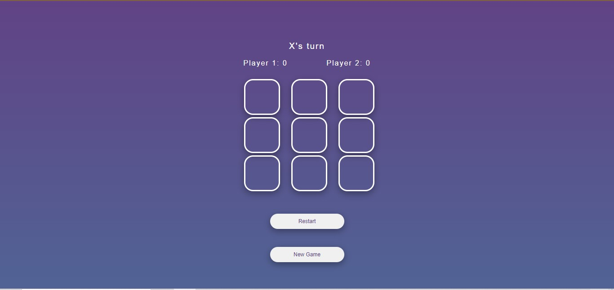

# Tic Tac Toe: A Classic Game of Strategy and Fun


## Description
Indulge in the timeless joy of Tic Tac Toe with my digital adaptation! Whether you're looking to pass the time with a friend or challenge your strategic skills, this sleek web version of the beloved game offers endless entertainment. Take turns placing your X's and O's on the grid, aiming to achieve a line of three symbols in a row, column, or diagonal. With intuitive gameplay and customizable options, Tic Tac Toe is perfect for players of all ages.

## Features

- **Interactive Gameplay:** Experience the thrill of competing against a friend in a game that's easy to learn but challenging to master.
- **User-Friendly Interface:** Enjoy a sleek and intuitive interface that makes playing the game a breeze.
- **Customizable Options:** Tailor the game to your preferences with options to choose player names and symbols.
- **Responsive Design:** Play seamlessly across various devices, whether it's on your desktop, tablet, or smartphone.

## Technologies Used

- **HTML5**
- **CSS3**
- **JavaScript**


## Figma

[Figma File](https://www.figma.com/file/HNIGWD1fuanB5fiNvWfBZm/Tic-Tac-Toe-(Main-Game)?type=design&node-id=0%3A1&mode=design&t=rWH8qRJI0gek5pnk-1)



# Setup

### Cloning the Repository
1. Clone the repository to your local machine:
   ```bash
   git clone https://github.com/saeedhalabi/Tic-Tac-Toe-Game.git

### Navigate the Project Directory
<code>cd Tic-Tac-Toe-Game</code>

### Running the project locally
1. Open the project folder in your preferred code editor
2. Locate the <code>index.html</code> file in your editor and open it with your web browser
3. Enjoy a game of Tic Tac Toe locally on your machine


<p align="center"><strong>Crafted with ❤️ by Saeed Halabi</strong></p>